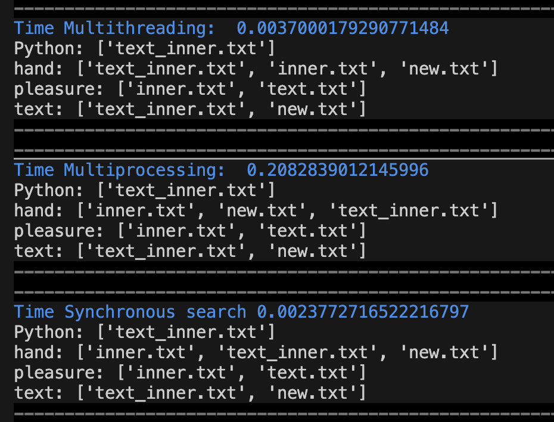

# goit-cs-hw-04

Multithreading and multiprocessing concepts. Key words searching problem solving using both technologies.

We perform the key words search in files using three methods:

- performing parallel search in different threads using Tread class from threading package
- performing parallel search in different processes using Process and Manager classes from multiprocessing package
- performing synchronous search

The results of key words search time is depicted on the following picture:

As we see multiprocessing approach is not effective for work with files. It is used for heavy calculations or processes. Multithreading approach shows good results and it is obvious that for large amount of files will show better time than synchronous one.
